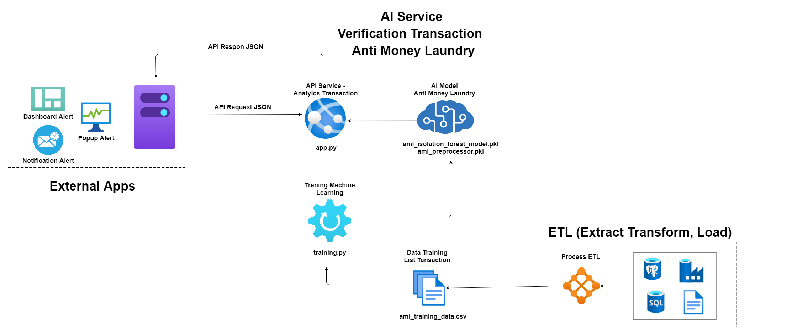
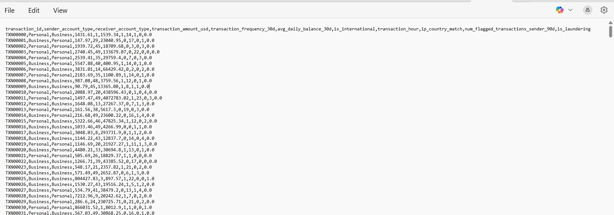
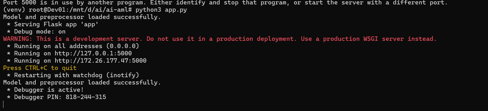
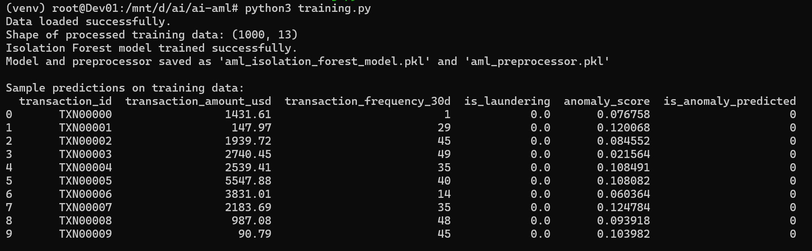
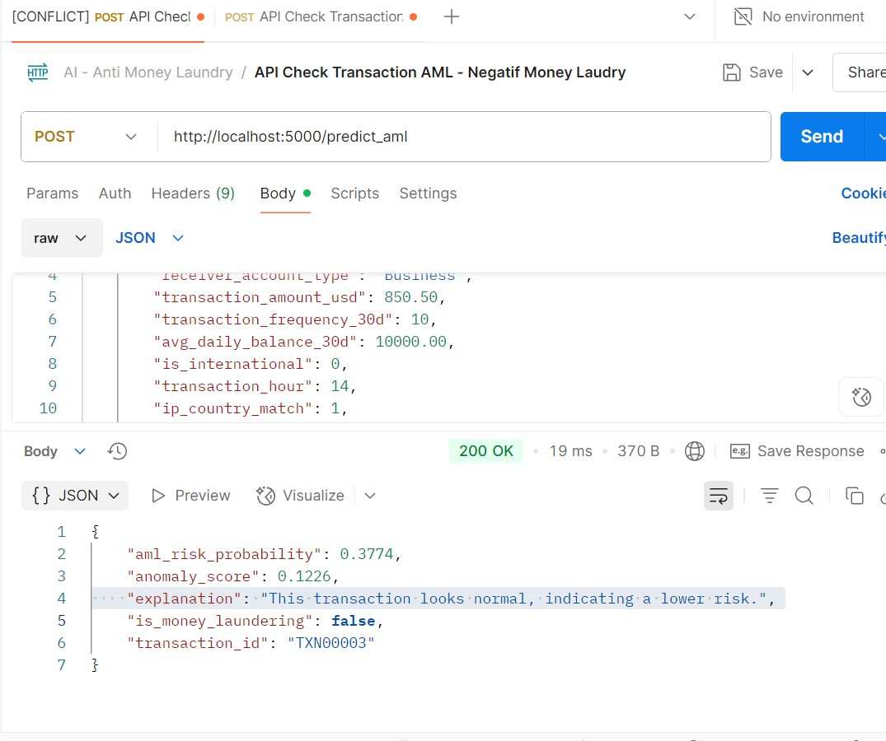
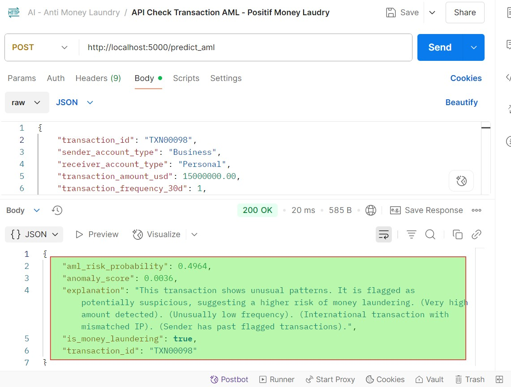

# AI Detective : Tracking Anti Money Laundering (AML)

In the busy world of digital finance, where billions of transactions flow every second, a hidden threat lurks: Money Laundering. 

Criminals constantly look for ways to hide their illegal money, making their tracks almost invisible.
But at a leading financial institution, a revolutionary innovation has emerged.

AI-powered Anti-Money Laundering Detection System. This is not just a regular program; it's a smart "brain" that works tirelessly, 24/7, to protect financial integrity.

**Table Of Content** 

    A. How This AI Detective Works
    B. Algorithm Isolation Forest: The Anomaly Expert
    C. The Moment of Truth: Real-time Prediction
    D. Technical and Visual Documentation
      1. Main Application Code (app.py)
      2. Model Training Code (training.py)
      3. API Testing with Postman 
      4. Postman Collection File (AI - Anti Money Laundry.postman_collection.json)

# A. How This AI Detective Works

This story begins with data. Every transaction — whether it's a bank transfer, a mutual fund purchase, or a bond investment — is a clue. 

This raw data, spread across various systems like SQL Databases and Data Warehouses, is collected and processed through an ETL (Extract, Transform, Load) process. 

This ETL process ensures that all relevant data is prepared and cleaned, then brought together in a neat format, like the **aml_training_data.csv** file you created.

This aml_training_data.csv file becomes the "textbook" for our AI detective. It contains 10 important variables that define each transaction:
    
    1. transaction_id: A unique number for each transaction, like a digital fingerprint.
    
    2. sender_account_type: The type of the sender's account (e.g., "Personal" or "Business"). Is this a transfer from an individual or a company?
    
    3. receiver_account_type: The type of the receiver's account. It's just as important to see where the money is going.
    
    4. transaction_amount_usd: The amount of money transferred in US Dollars. This number is often the first clue.
    
    5. transaction_frequency_30d: How often the sender has made transactions in the last 30 days. Unusual frequency patterns can be an alarm.
    
    6. avg_daily_balance_30d: The sender's average daily balance over the last 30 days. Large transactions from small balances can be suspicious.
    
    7. is_international: Is this an international transaction? Cross-border transactions are often a route for money laundering.
    
    8. transaction_hour: What time did the transaction happen? Was it in the middle of the night? Odd hours can be a sign.
    
    9. ip_country_match: Does the sender's IP country match their account country? A mismatch could indicate the use of VPNs or proxies to hide location.
    
    10. num_flagged_transactions_sender_90d: How many times this sender has been involved in previously flagged transactions in the last 90 days. A bad history is a strong warning.

With this data, our AI detective, operating as the "AI Anti Money Laundering Model", is trained using an advanced algorithm called Isolation Forest.

# B. Algorithm Isolation Forest: The Anomaly Expert

Isolation Forest is a very popular Machine Learning algorithm for anomaly detection. Unlike other algorithms that try to find "normal" patterns, Isolation Forest focuses on finding what is "not normal". 

Imagine it as a detective who quickly spots a stranger in a crowd. It does this by:

Isolating Anomalies: It builds many random "decision trees". Anomalies (suspicious transactions) are data points that are very easy to isolate or separate from the group of normal data with just a few splitting steps in the tree.

Efficiency: Because it only needs to isolate anomalies, not profile every normal data point, Isolation Forest is very fast and efficient, even for very large datasets.

After training, the model is saved in **aml_isolation_forest_model.pkl** and **aml_preprocessor.pkl** files. The aml_preprocessor.pkl acts as the model's "glasses," ensuring that all new transaction data is seen in the exact same format as when the model learned.

# C. The Moment of Truth: Real-time Prediction

When an external application (e.g., a bank system processing a transfer) sends transaction details in JSON format via an API Request JSON, your "AI Service - Analytics Transaction" (represented by app.py) receives this request.

**this program in app.py will quickly:**  
  1. Uses aml_preprocessor.pkl to transform the raw transaction data into a format ready for the model.    Feeds the processed data to aml_isolation_forest_model.pkl.
  2. The model then calculates an anomaly_score and an aml_risk_probability.
  3. Based on a predefined risk threshold (e.g., CUSTOM_AML_RISK_THRESHOLD = 0.3), the system determines whether is_money_laundering is true or false.
  4. Finally, an API Response JSON is sent back to the external application, containing key information: transaction_id, is_money_laundering status, aml_risk_probability level, and a brief explanation of why the transaction was flagged or not.

With this AI system, financial institutions now have eyes and ears that never sleep, ready to detect hidden traces of money laundering, safeguarding the security and trust in every financial transaction. 

This is a significant step forward in the fight against financial crime, where technology becomes the strongest ally of justice.

# D. Technical and Visual Documentation

This section provides screenshots and important configuration files to understand the implementation of this AI AML system.

**1. Main Application Code (app.py)**

Here's a screenshot of the app.py code that implements the RESTful API for AML prediction.

[Script Python app.py](./app.py)

**2. Model Training Code (training.py)**

This Data Training for machine learning 

This screenshot shows the Python code used to generate training data and train the Isolation Forest model.

[Script Python training.py](./training.py)

**3. API Testing with Postman**

This screenshot displays an example of testing the /predict_aml API using Postman, showing the request payload and the received JSON response.

**4. Postman Collection File (AI - Anti Money Laundry.postman_collection.json)** 

Here's a visual representation of the Postman Collection file that contains the API request details for testing. You can import this file into Postman to replicate the tests.

**This is a transaction suspected of money laundering**

**This is a transaction negatif of money laundering**

Download Postmannt Collection -> 
